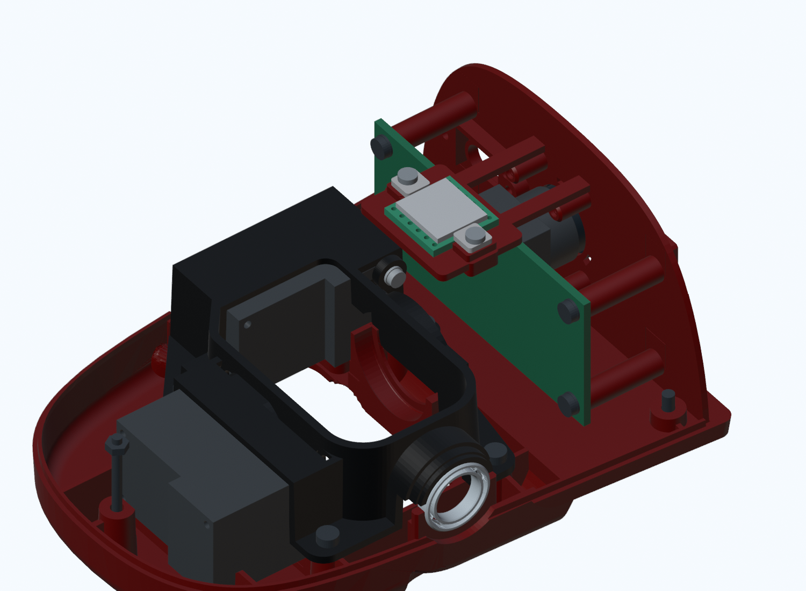
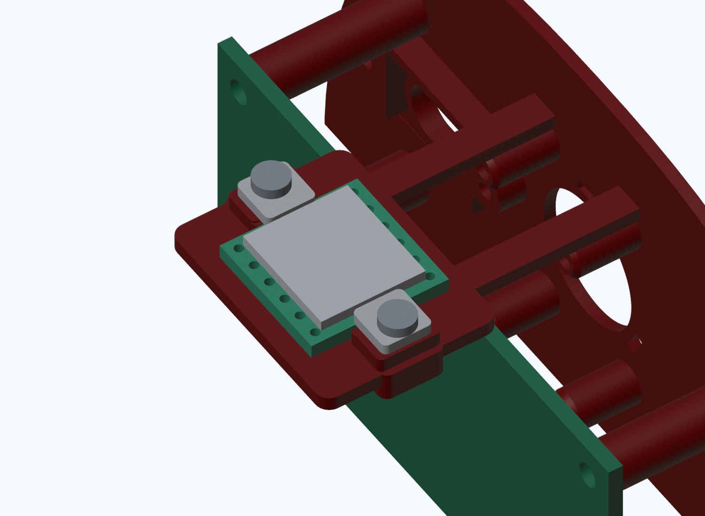
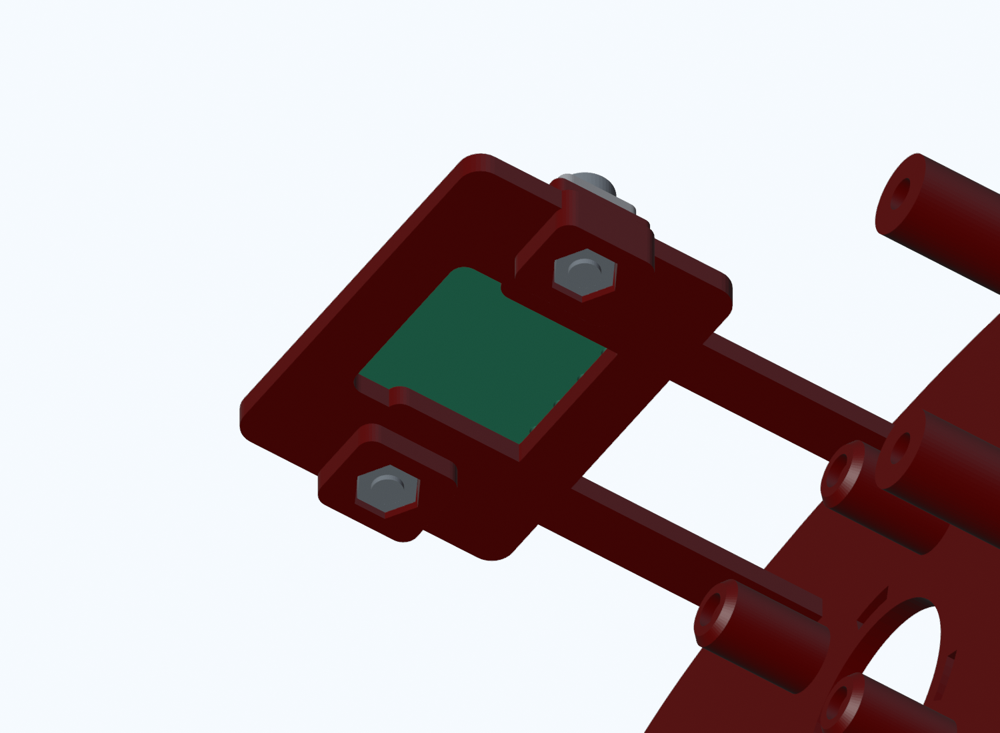

# MicroDinosaur v1：头部 JY61P 标准尺寸安装（v07）

2026-09-13。按用户要求先查公开尺寸、完成名义建模，不把实物测量作为继续建模的前提。

唯一现用入口：[MicroDinosaur_v1.blender](current/MicroDinosaur_v1.blender)。SHA256 `0a4f86aefea24e0d5260c837849a16164ec83cc2d364f58e6c03947de95ce286`。
755对象、663网格、672实体质量台账，19个S288／19个有效驱动。头部与躯干各一块JY61P名义包络；这不是实物已经安装、焊好或接通的声明。

## 尺寸依据与假设

按PDF图纸可视核对流程，采用带WitMotion标识的[JY61P尺寸图](https://cdn.shopify.com/s/files/1/0673/6848/5000/files/WitMotion-JY61P-Drawing.pdf?v=1782304757)，由[AIFITLAB产品资料页](https://aifitlab.com/products/witmotion-jy61p-sensor)链接。官方产品索引为[维特JY61P](https://wit-motion.cn/proztmz/37.html)。本地原图：`work_in_progress/electronics_clearance_v04/JY61P_vendor_drawing.pdf`及同名PNG。

| 项目 | CAD采用值 | 证据性质 |
|---|---:|---|
| 板外形 | 15.24×15.24mm | 标准JY61P图纸A/B |
| 总高度 | 2.8mm | 图纸E，不含排针/插头 |
| 焊盘节距 | 2.54mm | 图纸C |
| 两排中心距 | 12.7mm | 图纸D |
| PCB／上盖分层 | 1.6／1.2mm | 建模假设，不是图纸分项尺寸 |
| 增强款上盖 | 11.6×13×1.2mm | 选型包络假设，未核对到货版本 |
| 焊盘孔径 | Ø1mm | 示意假设，非安装螺孔，不据此钻板 |

公开图纸不保证用户增强款的屏蔽盖、背面元件、弯针焊接侧及插头与示意完全一致。已按标准建立可修改模型；实物核验用于之后的配合微调与制造验收，不撤回或暂停本轮建模。

## 安装结构

- 位于头内中线上方、相机后方与Pi上缘附近。参考姿态PCB中心为世界毫米 `[35,0,260.8]`，板底Z260。未扩大头壳，也未移动相机、嘴机构或Pi。
- 直接扩展原 `Rex_Camera_Pi_Carrier`：两条短支臂连接中央镂空托座，和相机属于同一刚性载架。没有把IMU粘在可拆顶壳或运动下巴上。
- 底部承托PCB周边、中央12×12mm开窗；两短边限位，另用两块板边压条固定。压条只压PCB边缘，不压上盖；不利用焊盘孔作固定孔。
- 两颗M2×6机牙螺钉配独立M2螺母；托座有底部开放的六角止转槽，不在打印件内假装已有金属机牙。螺钉和螺母为包络，没有虚构螺旋牙型或已确定的工具头型。
- 板两侧弯排针/插头空间用两个10×16×4mm非实体Empty预留，另有通向头内Pi的线缆空间。实际排针、插头、导线尚未装入；不能把预留称为已完成接线。

### 紧固与拆卸顺序

1. 断电，支撑头部，先拆顶壳；保护镜头、排线，断开IMU线缆。
2. 两颗螺母从托座底部装入六角槽，装配时托住；止转槽不是已验证的卡扣防脱结构。
3. PCB平放在托座，盖板朝上，两侧焊盘/弯针不被压条覆盖。
4. 两块压条放到压缩限位台上，再从上方旋入两颗M2×6螺钉。名义通孔Ø2.2、螺母对边3.5/厚1.6mm、槽对边约3.776mm；螺钉穿出螺母约0.4mm。实物头高、有效牙长、扭矩与打印收缩待复核。
5. 拆卸时卸两颗螺钉和压条，再向上取出PCB；已检查20mm直提路径。接头/线束未建实物，必须先拔线，不能照图硬拉。

## 校核结果与边界

证据：`work_in_progress/head_imu_v07/`；所有几何检查绑定delta及网格哈希，重开检查绑定模型哈希。

- 一件原载架就地替换网格，新增8个实体对象（PCB、盖板、两压条、两螺钉、两螺母）；另加3个非实体预留和1个传感器坐标Empty。原742对象的几何和参考世界矩阵不变，原父子关系／控制表达式／限位不变。
- 本次9件新/改网格均封闭、单连通；当前0隐藏实体、0孤立网格。没有叠放旧载架或另一套IMU方案。
- 清理/更新Scene里沿用的旧SG90/XL330/SC09、6V/GNB、BNO085、旧质量和旧版本活动标签，避免软件按错误配置解释新版；原对象控制属性保持不变。此元数据收尾不改变几何或渲染，详见scene_metadata_cleanup.json。
- 58组静态精确交集检查无新增非预期交集，4处原Pi螺钉与载架的既有啮合保持。
- 214原回归＋738腿组合＋653加密头颈/嘴姿态，对新IMU与修改载架无新增/加重碰撞。Blender重开实际重放1605姿态，父级矩阵差0；19驱动有效。仅是离散、变化范围审计，原全机极限问题没有宣称清零。
- 两个螺母各17个0.5mm装入样本、两条顶部工具轴通道、PCB卸夹后41个0.5mm直提样本无交集。工具轴检查以顶壳已拆为前提，不包括任意电批外壳。
- 名义间距：IMU上盖—顶壳最小约2.274mm，压条—顶壳约1.807mm，新增托座—Pi板约1.400mm；**螺钉头—顶壳最小仅0.616mm，属于需优先试装复核的小余量**，不能视为公差/挠曲已经通过。
- 原电控检修54mm上提／110mm侧移方案保留，没有移动其模块。本轮没有重新对所有线束和任意工具认证。

## 材质与质量估算

支座/压条按PA12、1.02g/cm³。PCB按FR4/铜混合包络1.85g/cm³，上盖/器件按混合包络2g/cm³，螺钉螺母按钢7.85g/cm³；后几项只是粗估，不等于每个器件材质已实测。盖板等包络质量按±50%不确定度记录，结构/五金按±25%。

| 部件 | 数量 | 合计估算 |
|---|---:|---:|
| 修改后的整个相机/Pi载架 | 1 | 7.701g（仅新增材料约1.021g） |
| JY61P PCB包络 | 1 | 0.660g |
| 上盖/器件包络 | 1 | 0.362g |
| 板边压条 | 2 | 0.064g |
| M2×6螺钉包络 | 2 | 0.508g |
| M2螺母包络 | 2 | 0.188g |

整机台账总估算 **1098.214g**，较v06增加约 **2.802g**。参考COM `[-68.641,-0.0015,144.586]mm`，向前变化约0.269mm，仍在足底包围盒中心后约10.657mm。BOM尚不完整、未切片/称重，不能据此保证站稳或实机动作。所有部件明细见 `current/parts_mass_estimate.csv` 与 `current/mass_estimate.json`。

## 双IMU职责与控制边界

躯干JY61P保留在现有电控模块，供身体姿态反馈，拟接F411。头部JY61P与相机固定在同一载架，供头部运动测量，拟就近接Pi，减少跨颈传感器线；这只是通信布局提案，不是已经实现的驱动和接线。

`FRAME_JY61P_HEAD_SENSOR` 是名义PCB中心坐标，已随刚性头部正确运动；真实芯片敏感轴与芯片位置尚未知。`current/imu_mounts.json` 记录头部CAD外参、躯干位置及待标定项，不能当作实物标定结果。禁止将头部IMU直接当身体平衡IMU；双六轴也不会自动消除航向漂移。实际电平/引脚、地址、延迟、数据新鲜度及时间同步仍需测试。

制造、打印、强度、电气、硬件使能、全范围/连续碰撞、步态和有效COM全部false。原S288供电/回灌、双路单线接口及F411固件等未完成项不因增加IMU而被放行。

## 版本与恢复

旧v06整机及头部局部库、记录和12张旧预览保存在 `exports/retired_before_head_imu_v07_20260913`，明确退役但可恢复。替换的旧载架网格已从当前工程清理，不靠隐藏退役。原Microduck蓝图哈希仍为 `16bc3a0c14ee2c6e4c587d992ec4eb1320338bed4b6a1e1520135f899f2e5434`。

旧100张历史截图校验保留，新增6张v07 CAD图与2张v06前态图，共108张。目录 `versions/screenshots/20260913_07_头部JY61P标准尺寸安装`，逐图记录来源/模型/图像哈希。WIP候选与冻结输入不是第二个现用模型。
