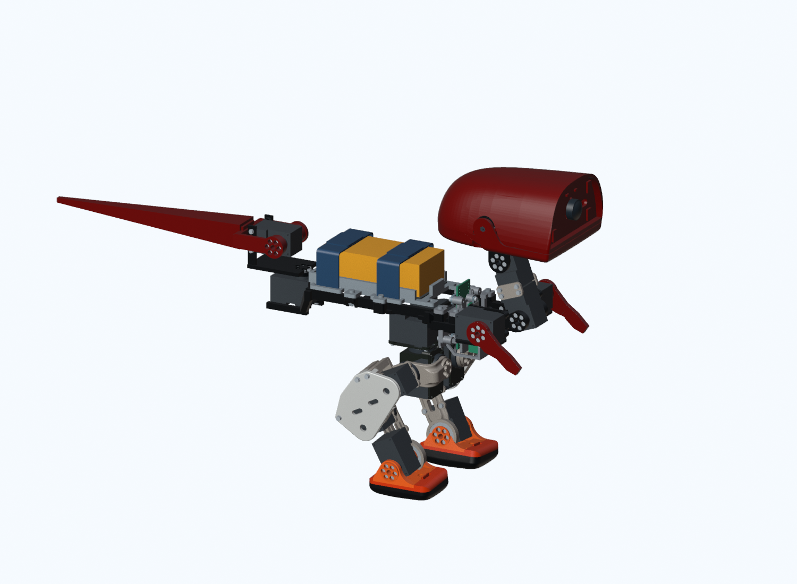

# MicroDinosaur

小型双足恐龙机器人的机械改型、强化学习训练与 IMU 控制实验。**2026-09-21 更新**：已整理当前训练代码、所选 ONNX、CPU 头控复现入口、动作复核与碰撞代理证据。项目处于设计与仿真到实物搭建的过渡阶段，尚未完成机身打印与实机验证。

先看 [项目进展](PROJECT_STATUS.md) 和 [动作达标矩阵](simulation/ACTION_STATUS.md)；代码、演示与复现入口见 [仿真与训练](simulation/README.md)。CAD 版本仍为下述 v07，文件哈希未改变。

MicroDinosaur v1 当前机械 CAD，版本为 **2026-09-13 / 头部 JY61P v07**。唯一现用模型是 [current/MicroDinosaur_v1.blender](current/MicroDinosaur_v1.blender)：755 对象、663 网格、672 条实体质量台账、19 个 S288 / 19 个驱动，头部和躯干各一块名义 JY61P。



先读 [当前设计](CURRENT_DESIGN.md)，再读 [v07 头部 IMU 评审](HEAD_IMU_V07_REVIEW.md)。模型 SHA256：

```text
0a4f86aefea24e0d5260c837849a16164ec83cc2d364f58e6c03947de95ce286
```

## 获取与打开

安装 Git LFS 与 Blender 4.5 LTS；本项目验证环境为 Blender 4.5.9。模型使用 Git LFS 保存，下载普通 ZIP 可能只得到指针文件，推荐克隆：

```bash
git lfs install
git clone https://github.com/eugenewang5425/MicroDinosaur.git
cd MicroDinosaur
git lfs pull
python scripts/verify_current.py
```

Windows 双击 `OPEN_MICRODINOSAUR_CURRENT.bat`。启动器依次使用 `BLENDER_EXE` 指定的程序、本地 `tools/blender-4.5.9-windows-x64/blender.exe`、PATH 中的 `blender.exe`。Blender 安装包不随仓库上传。也可以直接运行：

```bash
blender current/MicroDinosaur_v1.blender --python blender_controls.py
```

`.blender` 是用户指定的项目后缀，已验证命令行可以直接打开；无需改名。

## 文件组织

| 路径 | 内容 |
| --- | --- |
| `current/` | 唯一现用模型、清单、质量、紧固接口、IMU 外参、总线与 6 张当前预览 |
| `scripts/verify_current.py` | 无旧版本依赖的文件/台账校验；在 Blender 中还可检查实际对象、驱动和 v07 网格 |
| `scripts/head_imu_v07/` | 最新增量建模、静态/运动审计、渲染和发布脚本；详细依赖见该目录 README |
| `blender_controls.py` | 当前入口使用的 Blender 关节审阅面板 |
| `work_in_progress/head_imu_v07/` | 仅上传 v07 的增量几何和最终检查记录；路径均改为仓库相对引用 |
| `source/microduck_rl/` | 与当前模型来源相关的许可及说明 |
| `repository_files.json` | 本次上传文件逐项清单、大小和 SHA256（不包含清单自身） |
| `simulation/` | 当前训练源码快照、压缩资产、精选策略、头控 CPU 入口与历史实验结果 |
| `PROJECT_STATUS.md` | 设计、仿真与硬件的当前阶段及结果边界 |

Git 采用明确的文件白名单。旧 CAD 总成、采购资料、Blender 安装包、虚拟环境、缓存、个人简历及完整训练日志/检查点池留在本地。`simulation/` 仅收录明确选定的源码、必需兼容资产、策略和结果；它不增加第二个现用机械入口。

发布文件中的运行路径均使用仓库相对引用；未上传的本地训练日志和检查点池只在边界说明中按类别列出。远程仓库可打开、检查和渲染当前模型，但没有从旧版本完整重放增量构建的输入。下一轮建模应先冻结当前版本，再开展新的增量修改，见 [脚本说明](scripts/head_imu_v07/README.md)。

## 校验与边界

### 学习课题：CAD 实体与仿真碰撞代理不完全一致

复杂零件在仿真中通常需要更简单的碰撞几何。代理可能填满真实凹槽而误报，
也可能丢失薄壁或小凸起而漏报；增加碰撞开关不等于真实几何已经被准确表达。
这是本项目正在尝试解决的建模与机器人学习问题。

2026-09-20 的起身实验只覆盖 **7 对已知零件、8 条轨迹、488 个采样姿态**。
与 CAD 网格实体布尔交集对照，代理得到 99 个正确检出、23 个误报、24 个漏报：
**精度 81.1%**（报碰撞时有多少是真的），**召回率 80.5%**（真实碰撞中找到了多少）。
计数单位是“姿态 × 零件对”，不是动作成功率；两对小尺度碰撞完全漏检。
这些姿态也用于拟合代理阈值，因此属于**校准集表现，不能当作独立验收成绩**。
CAD 网格布尔结果也不包含实际打印公差、变形和测量误差。

下一步以独立命名的小版本改进机械间隙与碰撞代理，按动作和零件对分别报告
独立轨迹上的精度、召回率及实际动作成功率。没有真实碰撞样本的动作，其召回率
记为“不适用”，不写成 100%。当前版本和历史结果保留用于对照。

2026-09-21 的后续实验还展示了一个指标陷阱：同一个冻结代理、同样 5 个误报，
在两组策略轨迹中分别有 67 / 180 个正确检出，精度因此从 93.1% 变成 97.3%；
但动作通过率都只有 2/8，部分侧倒动作还退步了。**更高的碰撞检测精度不代表
动作更好，也可能只是新策略发生了更多真实碰撞。** 必须同时看误判计数、
状态分布和动作成功率。微小 CAD 交集低于约定体积容差时，也可能按规则记为误报；
应保留原始交集与判别规则，不能事后改门槛把结果变成通过。

同日又做了保持现有策略、质量/惯量和控制历史一致的碰撞开关对照：起身、跑步、
25mm参考加残差蹲起各20组配对，成功标签逐例相同（分别5/20、0/20、20/20）。
但逐关节审计发现：某次起身的躯干已接近站立，头部偏航轴仍持续约6.96秒接近
限矩。CAD头下壳与颈支架实际有约0.16–0.19mm间隙，是代理误挡；局部修正后，
同初态案例该轴最长高负载段降到约0.23秒，动作仍未完整通过。
**成功率没变，也可能存在值得修复的持续负载问题；整体站起来，也不代表每个关节都摆脱了顶撞。**
本项目因此优先检查动作成功、持续负载和退出能力，不以微小交集全部清零为目标。
以上是局部仿真证据，不是实机温升或完整鲁棒性认证；该候选尚未纳入正式发布模型。

2026-09-21 又以碰撞开启的 v07.1+r7 模型完成两阶段起身微调和同初态配对复核。
严格通过数从 15/40 提高到 18/40，但左/右侧仍只有 1/10、2/10；按项目约定只去掉
起身后的偏航门、保留站稳、限位和几何门时，也仅从 28/40 提高到 29/40。
最长高负载段由基线 2.969 秒降到 0.960 秒，但仍超过 0.5 秒筛查线；另有一次
0.005 秒、峰值约 0.13 N 的尾/座代理轻触。它的物理严重性很低，却仍违反了本轮
预先声明的零接触门，因此候选保留在研究区，没有替换正式策略。详见
[完整配对结果](simulation/research/20260921_action_requalification/RESULTS.md)。

`python scripts/verify_current.py` 仅需 Python 标准库；更深入的当前 CAD 检查运行：

```bash
blender --background current/MicroDinosaur_v1.blender --python-exit-code 1 --python scripts/verify_current.py
```

这些命令不保存或改动模型。已存档的 1605 姿态结果来自 v07 发布时的离散审计，便携校验只核对其绑定关系，不冒称重新执行该历史姿态集。

当前模型尚未获得制造、打印、强度、电气、实机、连续碰撞、步态或有效 COM 放行。质量约 1098.214 g 为未称重估算；真实增强款 IMU、接头、线束和螺钉头需试装，头部最近名义螺钉间隙约 0.616 mm。具体限制以当前设计与评审为准。

第三方几何来源与许可见 [NOTICE.md](NOTICE.md)。
