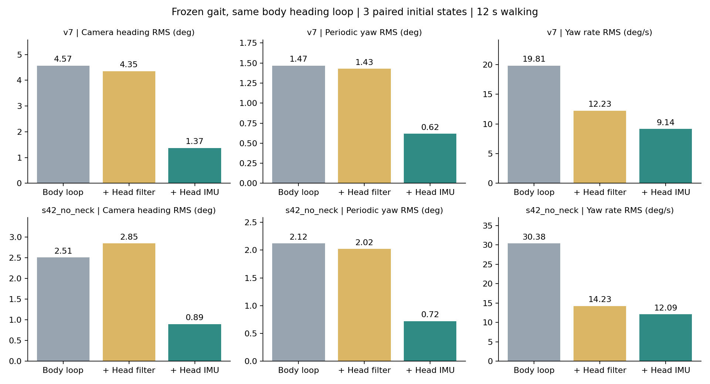

# 头部IMU已用于头部姿态控制

已经把头部IMU接入头部俯仰、偏航、横滚三个舵机的位置补偿。相机以导航期望前方和水平姿态为参考，有主动转头指令时改变目标；不控制头部横向位置。机身航向外环与原步态权重保留。**在当前名义仿真中，头部朝向与周期转头明显改善，前进速度变化小于1%。**

本次是头部IMU反馈加头部目标滤波的组合。仅头部策略目标增加100ms低通时间常数，腿部目标及物理kd=.8保持原样；100ms不是IMU运输延迟。输出仍经过原滤波、S288编码、电机10ms延迟和.6Nm力矩限制。头部、机身IMU用稳定校准及颈部编码器运动学对齐相对yaw零点，没有用仿真世界姿态驱动新头部反馈。

## 固定步态结果

以下为独立于开发初态的seed1/2/3平均，每次直走12秒。v7与较快候选均先由v7稳定站立6秒校准，候选随后切换。原方案已经有机身IMU航向闭环；这里只比较头部控制是否加入。

| 指标 | v7：原方案 → 头控 | 较快候选：原方案 → 头控 |
|---|---:|---:|
| 相机偏离期望前方 RMS° | 4.57 → **1.37** | 2.51 → **0.89** |
| 去趋势周期偏航 RMS° | 1.47 → **0.62** | 2.12 → **0.72** |
| 相机偏航角速度 RMS°/s | 19.81 → **9.14** | 30.38 → **12.09** |
| 俯仰 RMS° | 2.75 → **0.97** | 3.10 → **2.29** |
| 横滚 RMS° | 5.54 → **4.43** | 4.68 → **4.33** |
| 前进速度 cm/s | 23.08 → **22.96** | 27.24 → **27.02** |

两个策略、三个确认初态的朝向误差、周期偏航和偏航角速度共18个逐项比较，全部优于原方案和单独滤波。这里的RMS不是最大摆角，也不是持续朝一个方向转动的角速度。



## 哪些效果来自IMU

单独滤波已把v7/候选偏航角速度降到12.23/14.23°/s，加入IMU后进一步降到9.14/12.09°/s。因此，不能把全部消抖归功于IMU。更清楚的区别是周期偏航：单独滤波仍为1.43/2.02°，加入IMU后为.62/.72°；相机朝向偏置也明显减小。开发阶段单纯加大反馈增益反而增加快速转动，5次初轮与6次后续开发记录都保留。

## 站立、转向和残余问题

左右转向时头部参考随用户期望航向变化，完成转向后保持新的方向；没有锁死在出发时的世界方向。v7左/右转后保持的相机朝向RMS由3.92/5.03°降到.80/1.02°，候选由2.19/2.30°降到.82/.93°。

站立全程包含主动回正：v7偏航角速度RMS从.082升到1.46°/s，但剔除启动后最初2秒，剩余6秒为约.089°/s，原方案约.081°/s；朝向误差由1.90降到.49°。候选剩余6秒约.218°/s，原方案约.248°/s。这说明站立总RMS增加主要包含回正过程，v7仍有很小的持续控制动作，不声称完全静止。

横滚控制刻意弱于偏航：直走仍约4.43°/4.33°RMS，候选转弯时横滚还有轻微退步。主动头部命令补测也显示不是精确三轴云台：yaw请求14.32°时平台段约12.45°；pitch请求6.88°时约4.15°；roll请求5.73°时绝对平台段仅约.09°，相对于原有偏置虽有改变但跟踪明显不足。三轴反馈均已接入，当前主要验证成功的是面向前方和减少无指令转头。

头部控制会通过真实模型动力学影响身体。直走机身航向RMS v7约1.00→1.14°，候选5.87→6.55°，有小幅退步。相对机身的相机横向P95−P5范围v7约5.22→2.66mm，候选5.42→6.47mm；该横移仅作诊断，不作为本轮否决条件。

## 延迟与失效处理

冻结73次确认包含电机5/10/15ms、位置反馈20/40ms、.625/1.25ms物理步长、头部承载刚体质量+10%的单初态探针，相机主要指标仍改善。它们是灵敏度测试，不能代表所有因素同时变化或全参数空间覆盖。19个S288、双IMU和质量台账沿用现用模型；名义头部力矩峰值约v7 .571Nm/候选 .582Nm，未触及.6Nm饱和，仍不是实测温升或电源验收。

不利条件完整保留：IMU40ms采样+60ms运输时，冻结反馈配方把v7偏航角速度由19.62推高到22.62°/s。因此在单独的运行配置中，把头部反馈允许的数据年龄从120ms收紧到40ms。超过后逐步撤掉补偿，仅保留有界平滑头部目标；这代表暂停主动稳定，不代表慢IMU也有同样的稳像效果。

补测9次：两策略在名义数据下的全部轨迹和指标与冻结结果完全相同（仅配置年龄阈值不同）；慢数据下逐位等于仅滤波回退，v7/候选偏航角速度约12.24/14.22°/s。200ms丢帧验证了退出和恢复，未知丢失运动及残余零偏仍会留下偏差。残余+.5°/s时相机朝向RMS约2.56°，高于名义结果；长期yaw仍需视觉或其他绝对参考。机身外环的慢IMU局限也未由头部回退修复。

## 验证与复现

**73条冻结确认+9条数据陈旧回退验证，共82条正常仿真，未触发当前跌倒判据；14项自动测试通过。** 另11条开发轨迹单独存档。固定源码、策略、模型及完整逐条记录保留；无新RL训练，发布ONNX未替换，ERPO未引入。

测试涵盖30个随机姿态下CAD运动学/关节雅可比与MuJoCo一致、角度跨界、反馈符号、关节限幅和变化率、陈旧数据释放、重置复现、关闭头控时旧轨迹逐位一致、污染评分真值也不改变头控。演示入口复跑与对应确认记录逐项一致。视频采用预先指定seed1，每组300帧/25FPS，渲染全部指标与确认记录一致；查看了对照图与视频抽帧。

[v7开关对照视频](videos/v7/comparison.mp4) · [较快候选对照视频](videos/s42_no_neck/comparison.mp4) · [全部确认表](TABLES.md) · [冻结审计](audit.json) · [运行回退审计](runtime_followup/audit.json) · [实验约定](EXPERIMENT.md)

在工作区根目录复跑当前入口（输出目录必须新建）：

```powershell
& 'D:\microduck_rl\.venv\Scripts\python.exe' research/demo_head_attitude.py --policy v7 --head-mode imu --scenario straight --seconds 12 --out research/head_demo_new
```

`--head-mode off/filter_only/imu`选择对照；`--policy s42_no_neck`选择候选。`--head-motion yaw_scan/pitch_scan/roll_scan`复跑上述有意转头测试，不表示对应角度已精确跟踪。运行入口默认使用40ms头部数据年龄门限。

控制核心为head_attitude.py；head_attitude_sim.py接入传感器和舵机链；head_attitude_runtime.py保存补测后的年龄限制。旧步态actor的projected_gravity仍使用仿真姿态，硬件质量、IMU安装偏置/实际延迟、执行算力、完整碰撞和电机电源/热特性尚未完成实机辨识。本轮完成的是可复现仿真头控，未连接或驱动实物。
